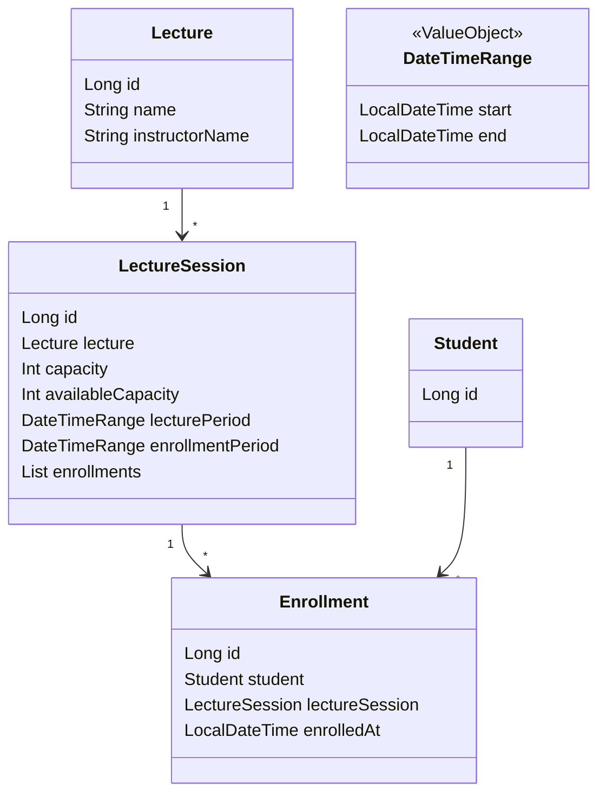
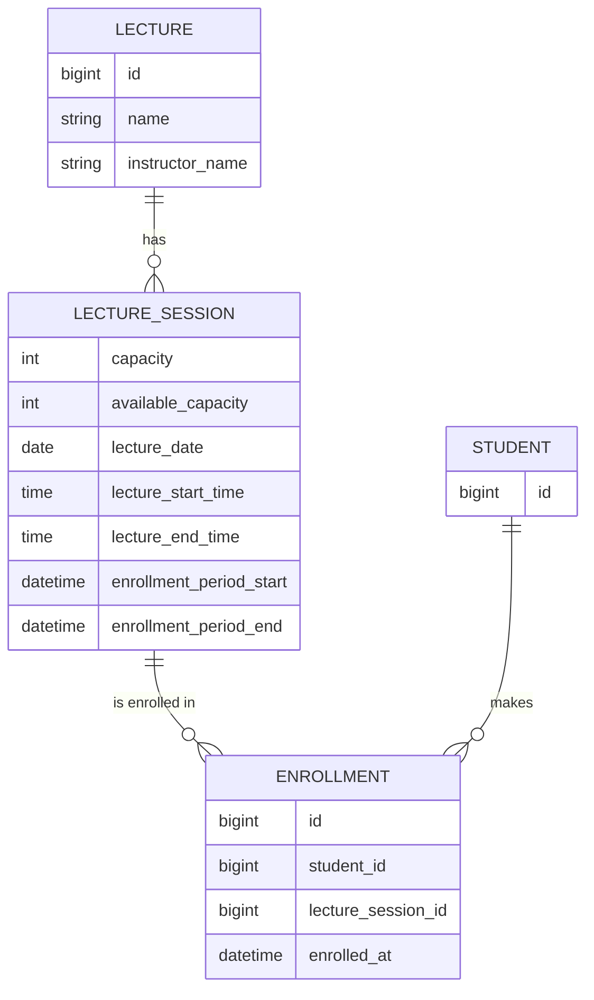

# 2주차 과제

- 특정 일시에 정원이 N 명인 특강에 대해 수강 신청 할 수 있는 서비스 만들기

## 요구사항 및 제약사항

- 특강은 신청 기간 동안에만 수강 신청을 받는다.
- 특강은 날짜별로 존재한다.
- 특강의 마감 일시는 특강의 강의 일시보다 미래일 수 없다.
- 특강은 선착순 30명까지만 수강 신청을 받는다.
- 사용자(학생)는 특정 특강에 수강 신청이 되었다면, 그 특강에 중복으로 신청할 수 없다.
- 사용자(학생)는 특정 특강에 대해, 수강 성공 여부를 확인할 수 있다.
- 어떤 사용자(학생)가 어떤 특강에 수강되었는지 내역을 볼 수 있어야 한다.

## 도메인 모델

### DatetimeRange

- 시작 시간과 종료 시간을 포함하는 기간을 나타내는 값 객체입니다.
- `start`: 기간의 시작 날짜와 시간
- `end`: 기간의 종료 날짜와 시간

### Lecture

- 특강에 대한 정보를 포함하는 엔티티입니다.
- 여러 LectureSession 을 가질 수 있어, 같은 강의가 여러 일정으로 제공될 수 있음을 의미합니다.
- `name`: 강의명
- `instructorName`: 강사 이름

### LectureSession

- 특강의 일정을 나타내는 엔티티로, 특강이 실제 진행되는 정보라고 할 수 있습니다.
- `lecture`: 진행될 특강 정보
- `capacity`: 정원
- `availableCapacity`: 수강 가능 인원을 나타냅니다.
- `lecturePeriod`: 실제 강의가 진행되는 일정 (DatetimeRange 타입)
- `enrollmentPeriod`: 수강 신청이 가능한 기간 (DatetimeRange 타입)
- `enrollments`: 이 강의에 대한 수강 신청 목록

### Enrollment

- 특정 학생이 특정 강의에 대해 수강 신청한 정보를 나타내는 엔티티입니다.
- Student 와 LectureSession 사이의 다대다 관계를 구현합니다.
- `student`: 수강 신청한 학생
- `lectureSession`: 수강 신청된 강의 세션
- `enrolledAt`: 수강 신청이 완료된 일시

### Student

- 수강 신청을 하는 학생에 대한 정보를 포함하는 엔티티입니다.
- 이 프로젝트에서는 최소한의 정보만 포함하고 있습니다.
- `id`: 학생의 고유 식별자

## ERD

### LECTURE

- 특강 정보를 저장하는 테이블입니다.
- `name`: 특강의 이름입니다.
- `instructor_name`: 강사의 이름입니다.

### LECTURE_SESSION

- 특정 강의의 개별 세션 정보를 저장합니다.
- `lecture_id`: 해당 세션이 속한 강의를 나타내는 외래 키입니다.
- `lecture_date`: 강의 세션이 열리는 날짜입니다.
- `lecture_start_time`, `lecture_end_time`: 강의 세션의 시작 및 종료 시간입니다.
- `capacity`: 해당 세션의 정원입니다.
- `available_capacity`: 현재 수용 가능한 인원입니다.
- `enrollment_period_start`, `enrollment_period_end`: 해당 세션에 대한 수강 신청 가능 기간입니다.
- `lecture_id`, `lecture_date` 에 unique constraint 를 넣어 같은 날짜에 같은 강의이 중복된 세션이 생성되는 것을 방지합니다.
- `LECTURE` 와 1:N 관계를 가지며, `ENROLLMENT` 와도 1:N 관계를 가집니다.

### ENROLLMENT

- 학생의 특강 수강 신청 정보를 저장하는 테이블입니다.
- `student_id`: 수강 신청한 학생의 id를 나타내며, STUDENT 테이블의 id 에 대응됩니다.
- `lecture_session_id`: 등록된 강의 세션을 나타내며, LECTURE_SESSION 테이블의 id 에 대응됩니다.
- `enrolled_at`: 수강 신청이 완료된 일시를 나타냅니다.
- `student_id`, `lecture_id`: 유니크 제약 조건이 있습니다.
- `STUDENT` 와 `LECTURE_SESSION` 사이의 다대다(N:M) 관계를 구현합니다.

### STUDENT 테이블

- 학생 정보를 저장하는 테이블입니다.
- `ENROLLMENT` 와 1:N 관계를 가집니다.
