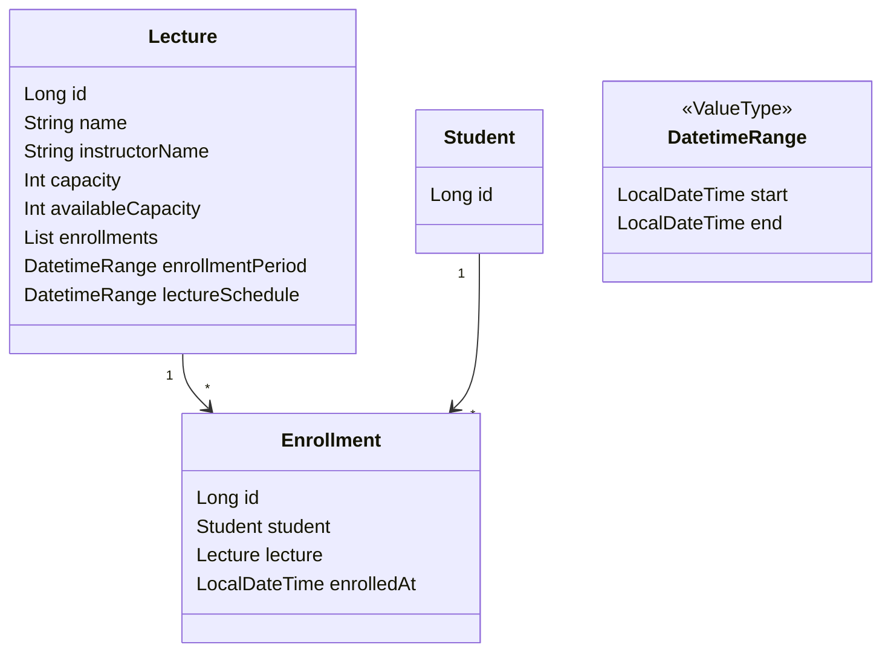
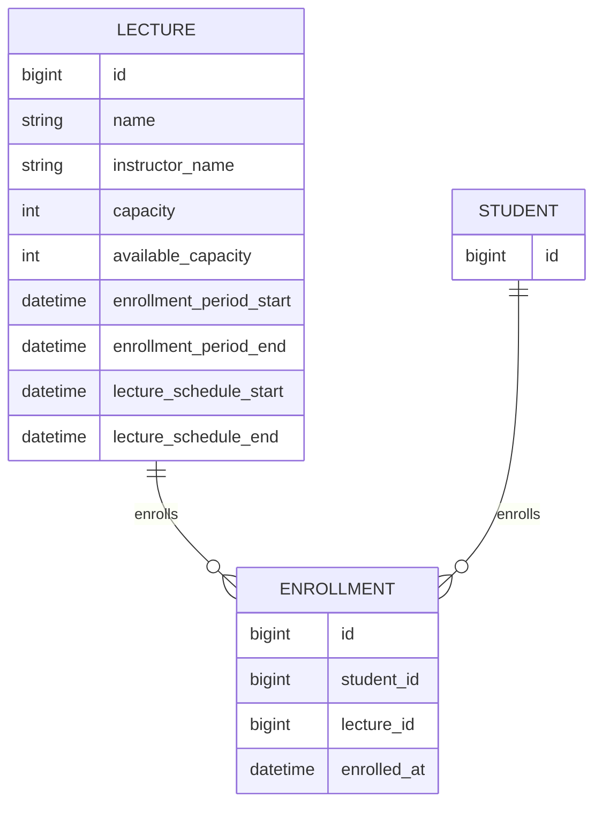

# 2주차 과제

- 특정 일시에 정원이 N 명인 특강에 대해 수강 신청 할 수 있는 서비스 만들기

## 요구사항 및 제약사항

- 특강은 신청 기간 동안에만 수강 신청을 받는다.
- 특강의 신청 기간은 4월 20일 토요일 1시부터 ~ 마감 일시까지이다.
- 특강의 마감 일시는 특강의 강의 일시보다 미래일 수 없다.
- 특강은 선착순 30명까지만 수강 신청을 받는다.
- 사용자(학생)는 특정 특강에 수강 신청이 되었다면, 그 특강에 중복으로 신청할 수 없다.
- 사용자(학생)는 특정 특강에 대해, 수강 성공 여부를 확인할 수 있다.
- 어떤 사용자(학생)가 어떤 특강에 수강되었는지 내역을 볼 수 있어야 한다.

## 도메인 모델

### DatetimeRange

- 시작 시간과 종료 시간을 포함하는 기간을 나타내는 값 객체(Value Object)입니다.
- `start`: 기간의 시작 날짜와 시간
- `end`: 기간의 종료 날짜와 시간

### Lecture

- 특강에 대한 정보를 포함하는 엔티티입니다.
- 수강 신청 가능 여부 확인, 수강 신청 처리, 현재 등록된 수강생 수 관리를 합니다.
- `id`: 강의의 고유 식별자
- `name`: 강의명
- `instructorName`: 강사 이름
- `capacity`: 정원
- `availableCapacity`: 수강 가능 인원을 나타냅니다.
- `enrollments`: 이 강의에 대한 수강 신청 목록
- `enrollmentPeriod`: 수강 신청이 가능한 기간 (DatetimeRange 타입)
- `lectureSchedule`: 실제 강의가 진행되는 일정 (DatetimeRange 타입)

### Student

- 수강 신청을 하는 학생에 대한 정보를 포함하는 엔티티입니다.
- 이 프로젝트에서는 최소한의 정보만 포함하고 있습니다.
- `id`: 학생의 고유 식별자

### Enrollment

- 특정 학생이 특정 강의에 대해 수강 신청한 정보를 나타내는 엔티티입니다.
- `id`: 수강 신청의 고유 식별자
- `student`: 수강 신청한 학생 (Student 엔티티 참조)
- `lecture`: 수강 신청된 강의 (Lecture 엔티티 참조)
- `enrolledAt`: 수강 신청이 완료된 일시

## ERD

### LECTURE

- 특강 정보를 저장하는 테이블입니다.
- `name`: 특강의 이름입니다.
- `instructor_name`: 강사의 이름입니다.
- `capacity`: 특강의 정원을 나타냅니다.
- `available_capacity`: 수강 가능 인원을 나타냅니다.
- `enrollment_period_start`, `enrollment_period_end`: 수강 신청 가능 기간의 시작과 끝을 나타냅니다.
- `lecture_schedule_start`, `lecture_schedule_end`: 강의 시간의 시작과 끝을 나타냅니다.

### ENROLLMENT

- 학생의 특강 수강 신청 정보를 저장하는 테이블입니다.
- `student_id`: 수강 신청한 학생의 id를 나타내며, STUDENT 테이블의 id 에 대응됩니다.
- `lecture_id`: 수강 신청한 특강의 id를 나타내며, LECTURE 테이블의 id 에 대응됩니다.
- `enrolled_at`: 수강 신청이 완료된 일시를 나타냅니다.
- `student_id`, `lecture_id`: 유니크 제약 조건이 있습니다.

### STUDENT 테이블

- 학생 정보를 저장하는 테이블입니다.
- 현재는 최소한의 정보만 포함하고 있지만, 필요에 따라 이름, 이메일, 학번 등의 추가 정보를 저장할 수 있습니다.

