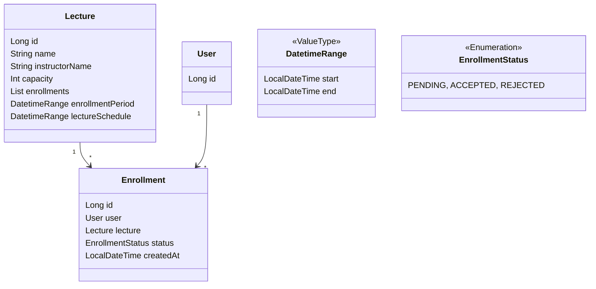

# 2주차 과제
- 특정 일시에 정원이 N 명인 특강에 대해 수강 신청 할 수 있는 서비스 만들기

## 요구사항 및 제약사항
- 특강은 신청 기간 동안에만 수강 신청을 받는다.
- 특강의 신청 기간은 4월 20일 토요일 1시부터 ~ 마감 일시까지이다.
- 특강의 마감 일시는 특강의 강의 일시보다 미래일 수 없다.
- 특강은 선착순 30명까지만 수강 신청을 받는다.
- 사용자는 특정 특강에 수강 신청이 되었다면, 그 특강에 중복으로 신청할 수 없다.
- 사용자는 특정 특강에 대해, 수강 성공 여부를 확인할 수 있다.
- 어떤 사용자가 어떤 특강에 신청했는지 내역을 볼 수 있어야 한다.

## 도메인 모델
- Lecture
- Enrollment

